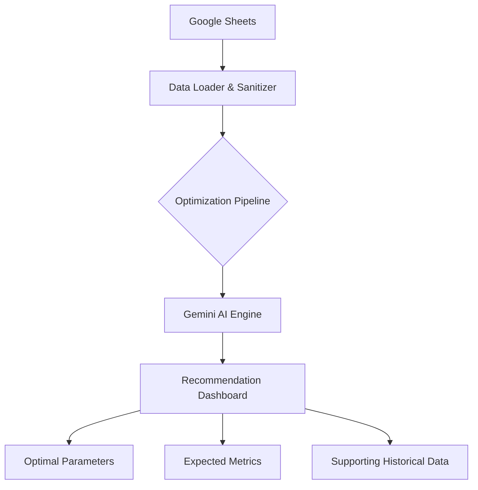

# Strategy Reader: How It Works

The Strategy Reader is an automated assistant for quantitative traders. It bridges the gap between your manual strategy experiments (stored in Google Sheets) and the data-driven insights needed to optimize your trading parameters.

Here is the step-by-step journey of your data, from your spreadsheet to the AI-generated recommendation.

## 1. Data Collection (The Spreadsheet)

Everything starts in your Google Sheet. You maintain a row for every strategy experiment you run. This includes the **Date**, **Scope** (the strategy name), **Parameter Set** (a JSON snapshot of your settings), and the performance outcomes like **Fills** and **PnL**.

## 2. Intelligent Ingestion

When you request a report for a specific strategy, the system performs a deep scan of your sheet:

- **Merged Cell Recovery**: It "forward-fills" merged cells, so if you grouped experiments by date in your sheet, the system automatically detects which strategy and date applies to every row.
- **Row Sanitization**: It ignores empty or invalid rows. If a row is missing a critical piece of data (like a date), it redacts it to prevent inaccurate analysis.
- **JSON Resilience**: It reads your "Parameter Set" column—even if you accidentally left off a curly brace or used single quotes—and converts it into a clean, structured object the computer can read.

## 3. The AI Optimization Pipeline

Once the data is clean, the system initiates the AI Optimization Pipeline:

- **Filtering**: It isolates every single historical experiment that matches your selected Strategy and Date.
- **Contextual Analysis**: It bundles this entire dataset (Hypothesis, Stop Conditions, Parameters, Verdicts, PnL, Fill Rates) and sends it to the Google Gemini API.
- **Synthesized Intelligence**: Gemini analyzes the historical trends. It doesn't just look for "high PnL"; it looks for patterns. It understands:
  - Why certain parameter changes led to specific outcomes.
  - How changing one parameter (like Stop Loss) interacts with another (like Entry Cap).
  - Which configurations were successful under specific market regimes.

## 4. The Recommendation (The Dashboard)

Gemini generates a structured response that is displayed on your dashboard:

- **AI Optimal Configuration**: The system displays the specific parameter set the AI believes will yield the best results, grouped by logical panels (e.g., "Sizing," "Phase Gates," "CSS Weights") to match your actual trading platform's interface.
- **Predictive Metrics**: It calculates the Expected Session PnL and Expected Fill Rate to give you a concrete performance projection.
- **Historical Evidence**: You can see every single experiment used to reach this conclusion in the Historical Supporting Data table, complete with status badges and concise AI-generated summaries of what happened during those past tests.
- **Deep Insights**: A final Gemini-authored section explains the "Why" behind the recommendation, providing the expert-level qualitative context that raw math alone cannot provide.

## Summary Diagram

## Key Capabilities

**100% Deterministic Data**: It only uses the experiments you have actually performed.

**Intelligent Redaction**: It skips incomplete rows, ensuring your recommendations are never skewed by "work-in-progress" tests.

**Contextual Awareness**: It understands your human-written notes, verdicts, and hypotheses, not just numbers.

**UI-Ready**: Parameters are grouped into panels that mirror your real-world trading platform, making it instant to copy-paste your new settings.
